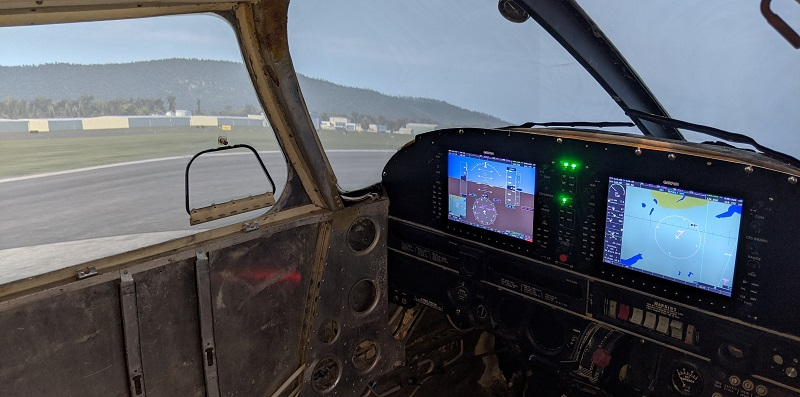
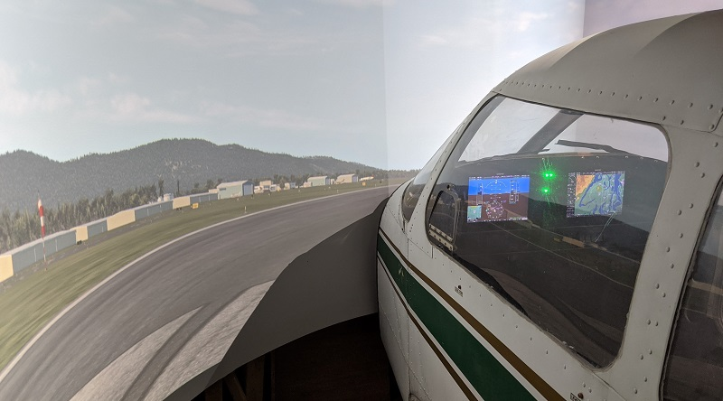

# Piper PA-28 project

After many years of flight simming, I'm currently building a flight simulator using the cockpit from a 1975 Piper PA-28-151 interfaced to X-Plane 11 using AirManager.

For more information, see [the Piper PA-28 project website](https://fouldsy.github.io/piper-pa-28-flight-sim/index.html)

Current view of the inside of the cockpit:

Fully functional:

* Garmin G1000 PFD, audio panel, and MFD
* OEM switch panel
* Throttle and mixture controls

In progress:

* Parking brake

Current view of outside of the cockpit:

The 12ft diameter 180 degree curved screen uses two Optoma GT1080 short-throw projectors warped using [Immersive Display PRO from  Fly Elise-ng](https://fly.elise-ng.net/immersive-display-pro/). The screen surface is painted a light grey.

The screens and projectors are functional, but need refinement and additional calibration. This is my current project