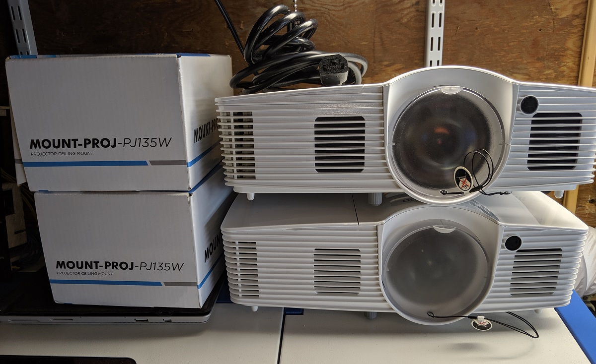
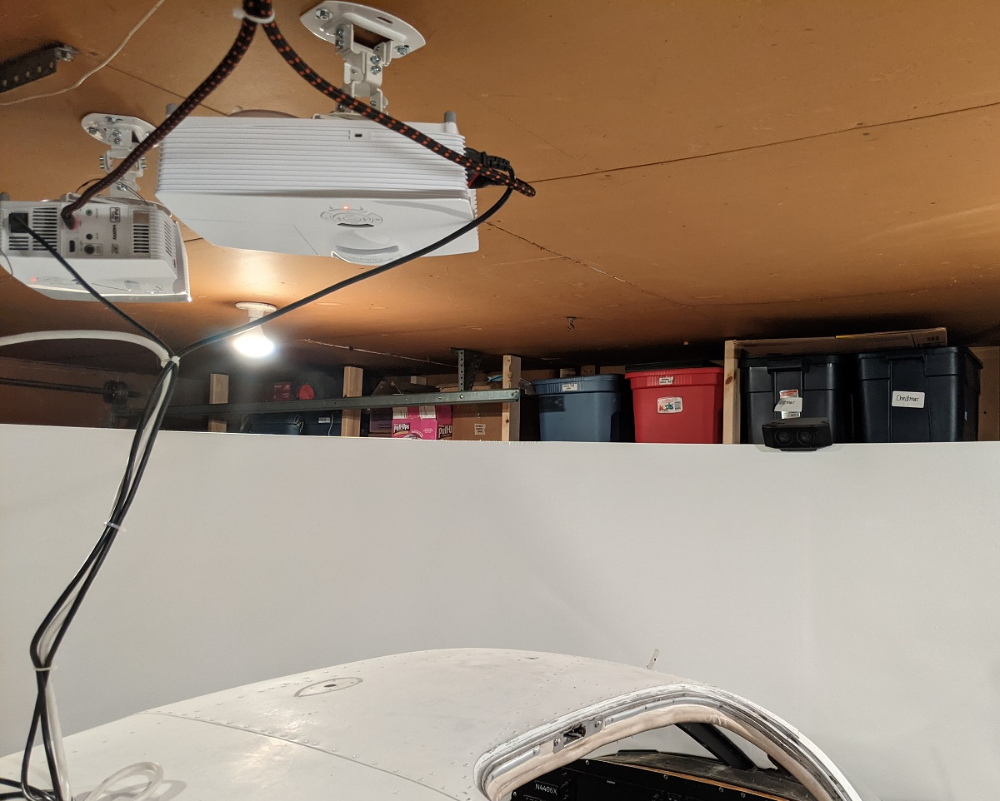
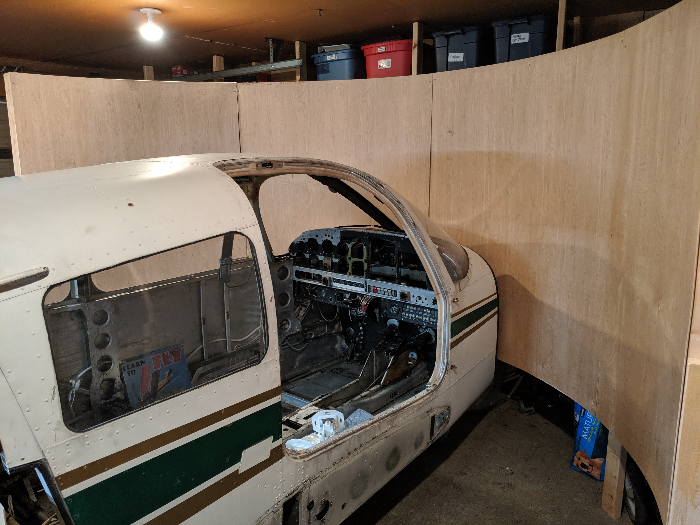
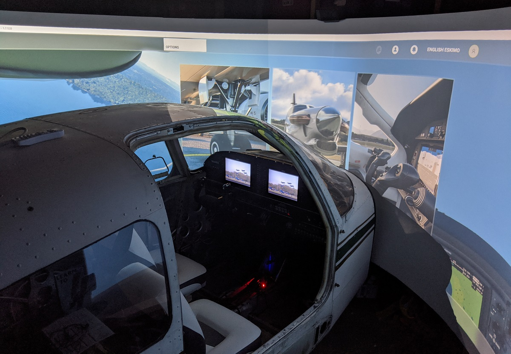

# Audio and visuals

The cockpit is the focal point of the flight simulator, but the visuals are just as important to the whole look and feel.

The desktop PC that runs the flight simulator is as follows:

* Intel i7-10700k 8-core 3.8Ghz
* 32GB DDR4 3600
* EVGA nVidia GeForce RTX 2070 Super 8GB
* MSI MPG Z490 Gaming system board
* Samsung 970 EVO M.2 1TB
* WD Blue 3D NAND 1TB SSD
* Corsair iCUE H115i water cooling with 280mm radiator and dual 140mm fans

## Projectors

From the outset, I knew I wanted a minimum of two 1080p projectors to build a 180-degree curved screen. Two projectors is pushing the limits of a 180-degree screen, and I'd ideally like to add a third projector and extend to 220-degrees or more.

Currently, the flight sim uses two [Optoma GT1080 projectors](https://www.optoma.com/us/product/gt1080/) mounted to the ceiling.

The projectors are mounted so that their images cross each other with a 15% or so overlap on the screens. So, the left projector is actually displaying the right-hand side of the curved screen, and the right projector is the displaying the left-hand side of the curved screen.

Both projectors then connect via HDMI cables to the desktop PC that runs the flight simulator.

## Curved screen

I can't take credit for the curved screen design. The [A-10 Warthog project had a video](https://www.youtube.com/watch?v=AsleWkgOsak) on how he built a cheap curved projection screen that I followed almost exactly. I built a 12ft diameter 180-degree curved screen that wraps around the cockpit. The size of the screen was based around the length of the cockpit to given a wrap-around perspective.

The projection screen is raised 2ft off the ground, and the projection surface is 5 feet tall. With only using two projectors I don't quite fill all the space, but it's good enough for my uses. The projection screen was given a light skim coat of plaster to remove the wood grain texture and was then painted a light grey.

## Audio

Top quality audio wasn't critical for me, but I have created an immersive system. I use an old [Logitech X-540 5.1 sound system](https://www.newegg.com/logitech-x-540/p/N82E16836121006) with the subwoofer mounted just outside the cockpit by the pilot side. The front speaker is mounted at the top of the curved projection screen in front of the cockpit, with the left and right speakers mounted on the side of the projection screen facing inwards at about seating height when inside the cockpit.

The Logitech controls are on the floor between the pilot and co-pilot seat, so I can turn the system on and off or adjust volume from the pilot seat. Although I don't have the rear speakers hooked up, it's still good immersion, and you can hear an airplane move across the speakers as it would pass across the screen.

Powering the audio is a [basic USB audio adapter](https://www.amazon.com/gp/product/B004HXGJ3S). I looked at using the desktop PC sound card, but that would involve running a lot more cables out to the flight simulator. The USB audio card works well, and gives me the option to plug in a headset for the pilot in the future if I want to try adding a little more immersion.

## Additional systems

A [10-port USB hub](https://www.amazon.com/gp/product/B076YN6CSG) in the cockpit lets me run [one long USB cable](https://www.amazon.com/gp/product/B000W0BVTW) back to the desktop PC that runs the flight sim. I can unplug this one USB cable to disconnect the whole cockpit when I use the PC for other games and I don't want the flight controls inteferring with anything.

The USB hub runs two Arduino Megas for the Garmin G1000 PFD and MFD, and then four Arduino Nanos for the G1000 audio panel and rest of the flight controls. The Honeycomb Alpha yoke and audio adapter are also connected via USB.

Finally, a [small backlight keyboard / mouse combo unit](https://www.amazon.com/gp/product/B07T13GLY3) gives me some amount of regular PC input when in the cockpit. This unit connects via a USB Bluetooth adapter connected to the USB hub. Ideally, this keyboard should only be needed to set up a flight. Everything else should be able to function using the actual flight controls in the cockpit.