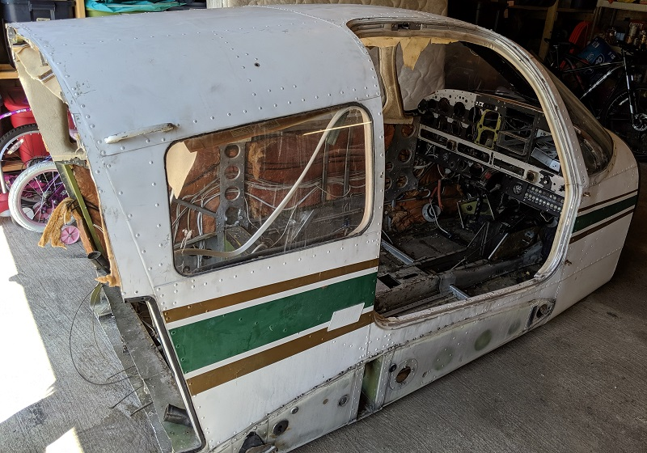
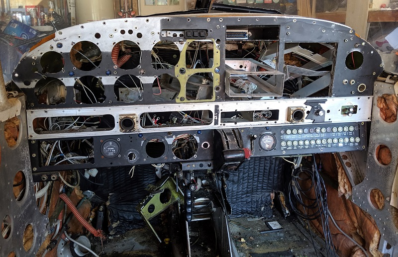
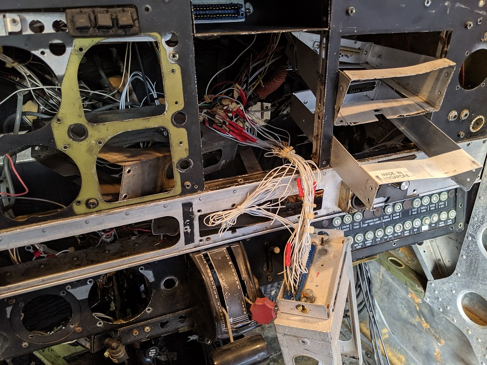
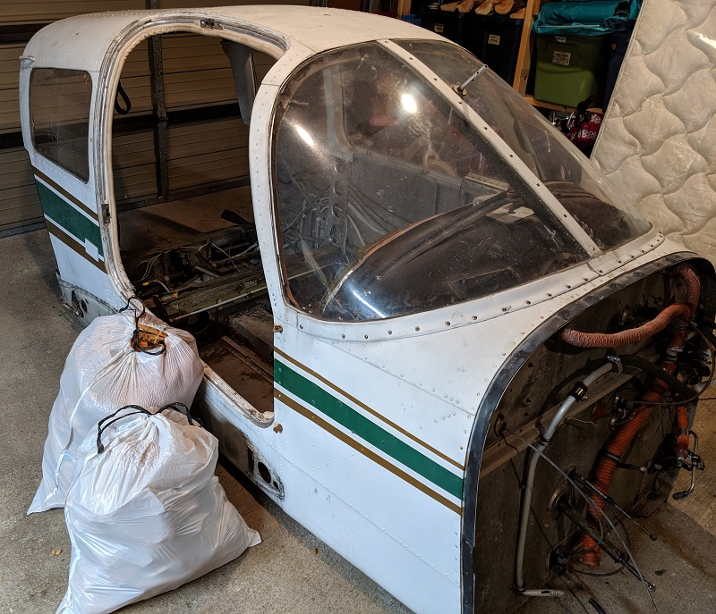
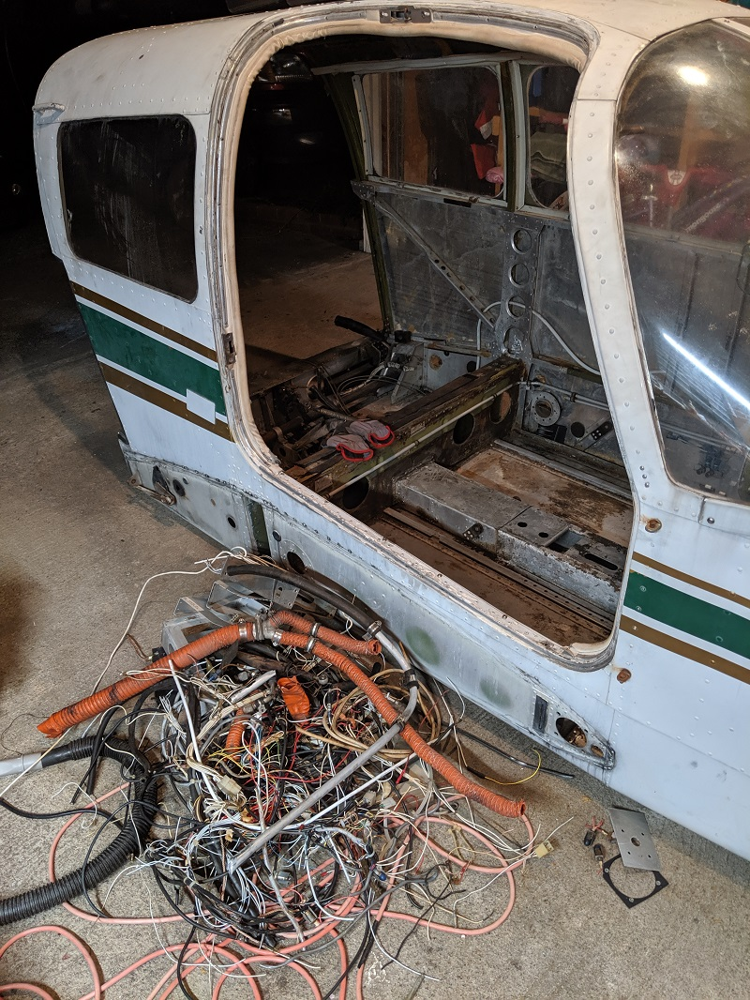
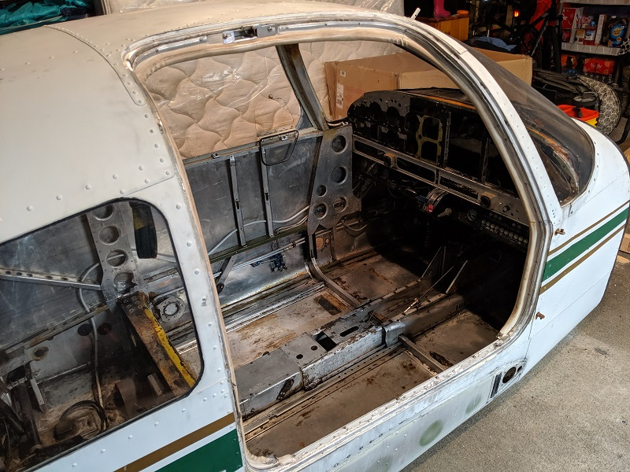
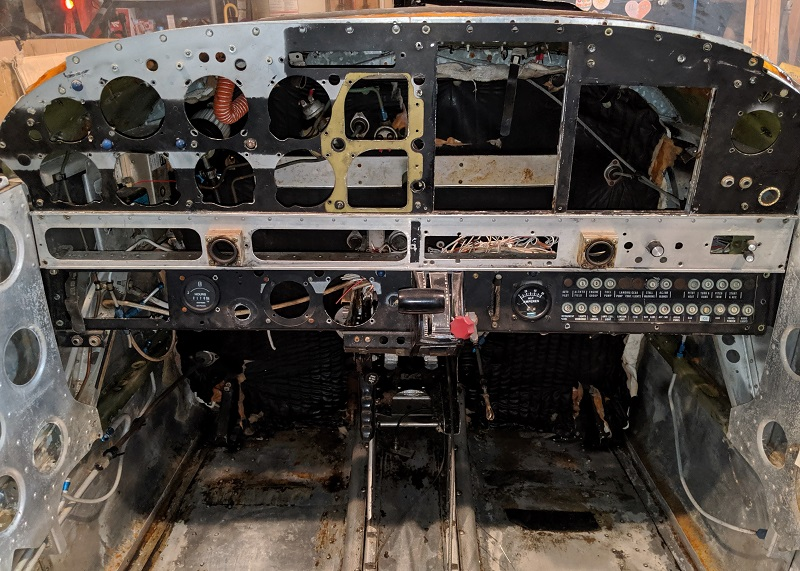
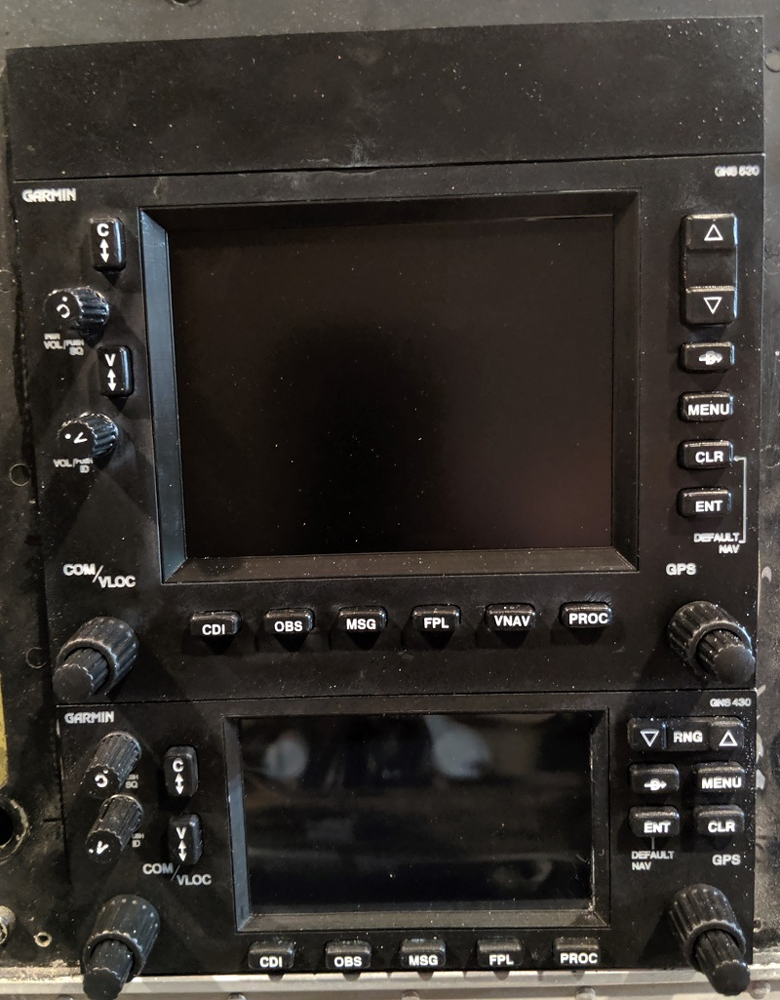
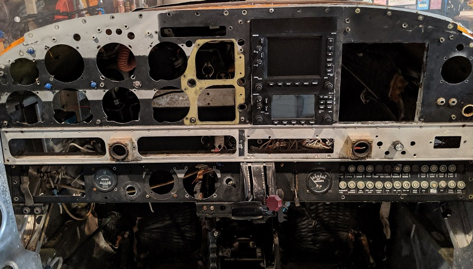
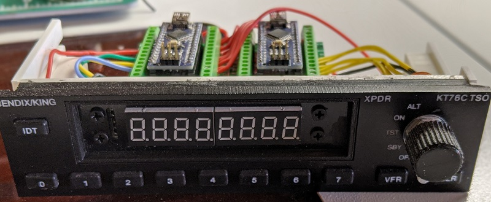

## The cockpit

The key part of the flight sim is, obviously, the cockpit :) The immersion of being inside an actual cockpit is quite something.

The flight sim is based on the following:

* **Aircraft:** 1975 Piper PA-28-151
* **Tail number:** N4406X
* **Serial number:** 28-7615012
* **Hobbs meter:** ~2070 hours

## Purchase and delivery

I'd originally been set on the cockpit for a Cessna 172, but price-wise, I was never able to find one that was within reach. I had no real attraction to the Piper PA-28 other than it's what I was able to finally find at a decent price.

There's a number of sellers out of Florida that seem to have GA fuselages for sale. Most are still considered airworthy, hence the price tag that goes with them.

I was able to find one that had been left sitting outside in te Florida sun and was no longer classed as airworthy. Most of the internal components were stripped and sold individually. The fuselage was available for $950 US.

I was able to have the seller cut the fuselage just behind cargo compartment. I didn't need the mid and tail-section. This helped cut down enormously on crating and shipping.

It took 2-3 weeks to freight it all the way from Florida to Seattle, and I don't have any pictures of it crated as we had to take it out the crate in the back of the delivery truck just to fit it on the lift gate and into the garage!

This was my first time seeing just what I'd let myself in for. The interior was a mess, which I could tell from the listing photos.

Most of the interior was soon to be ripped out anyway, along with most of the instrument panel.

## Cleaning the interior

After assessing what the cockpit had and what was worth keeping, I then set about cleaning everything up. First, I removed all the old interior fabric, insulation, and coverings. It was surprising just how much there was to come out of a fairly stripped-down cockpit to begin with.

There was also so much wiring and tubing throughout, most of which I wanted to remove to make it easier to clean and then route the flight sim components for USB, HDMI, power, etc.

With almost everything stripped back to the bare metal, I could then clean up all the actual interior bodyframe and metal itself. This was time consuming and messy, but overall made it a much better starting point to crawl around inside of to install the flight sim components.

I couldn't get everything out from behind the instrument panel without removing the entire panel, which while tempting, seemed a little unnecessary and too much work. But even like this, it gave a much better starting point to then begin building the flight simulator.

## Initial component installation

One of the main reasons I'd wanted a Cessna 172 cockpit was to use a Garmin G1000 suite. As much as there's an appeal to steam-driven gauges, since I can't fly for real, I've always been attracted to the G1000 panels.

Initially, I was going to stay true to steam-driven gauges, so built a Garmin GNS-430 and GNS-530 unit based on the designs by [Allan Glen](https://cessna172sim.allanglen.com/).

These units worked okay, and it was a great learning experience with the laser cutter, 3D printer, and Arduino wiring / Air Manager connections.

By the time I was working on the Bendix King KT76C transponder and initial designs for 3D printed gauges using stepper motors, I realized that it wasn't really what I wanted.

I was fine with the cockpit itself, but trying to remain true to the PA-28-151 just wasn't going to cut it. So, I explored X-plane models for the Piper PA-28 181 and similar that offered a G1000 suite, and [ended up going down that route instead](g1000.md).

So, the cockpit is somewhat of a mix of a PA-28-151 in terms of the switch panel and instrument panel layout, but upgraded for a G1000 suite :) I don't think many real-world owners of a PA-28-151 would foot the bill for such an upgrade, but hey - it's my plane, so I can do it!