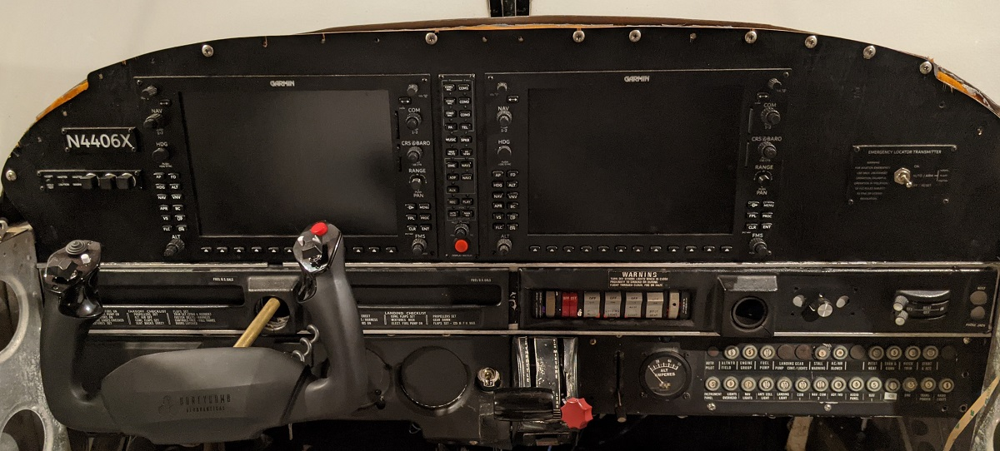
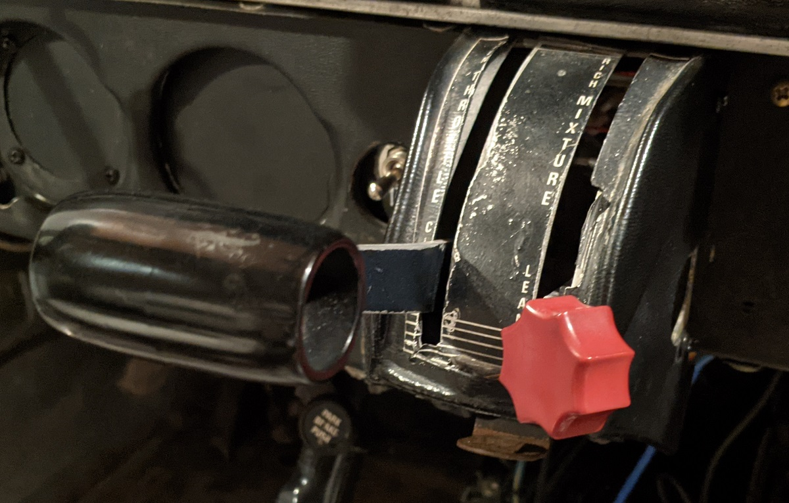
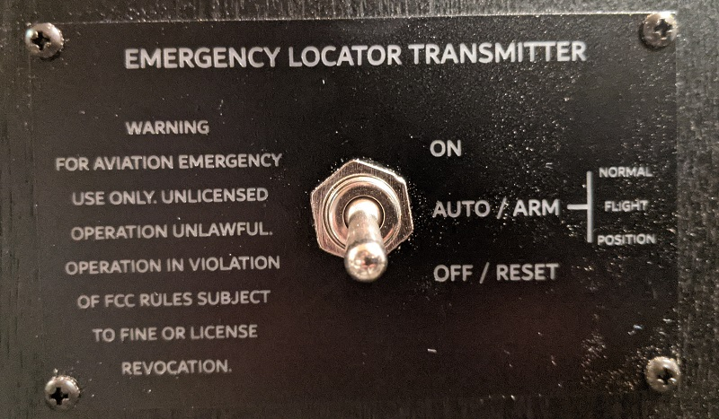

# Flight controls.

Where possible, I've tried to use OEM parts. The cockpit itself is a Piper PA-218-151, but I've given myself a little wiggle room since in X-Plane 11 I'm flying a PA-28-161.

## Flight yoke

The primary non-OEM part in the whole cockpit (aside from the G1000 units) is the yoke. I looked at ways to use an OEM yoke with a home-built control system, or to retrofit an OEM yoke onto a commercial USB yoke.

In the end, I went with the [Honeycomb Aeronautical Alpha yoke](https://flyhoneycomb.com/collections/honeycomb-flight-sim-hardware/products/alpha-flight-controls). I like the idea of having some additional controls on the yoke that could be mapped into the game if I wanted to change the views or for ATC communication, etc.

The shaft of the yoke had to be extended for enough travel since it's mounted behind the panel. Without extending the yoke, my hands were so close to the G1000 units it was almost unusable. Thankfully, the Honeycomb yoke doesn't have wires that run through the shaft itself like some other yokes do. Instead, it's a solid steel shaft. I cut the steel shaft then used brass tube that I could slide over the existing steel shaft. This brass tube is glued with J-B Weld.

Mounting the yoke was tough. There's very little room between the cockpit panel and the firewall, and the Honeycomb yoke only *just* fits in there. I made a platform for the yoke to attach to with its screw clamps. The platform is attached into the firewall and the sides of the cockpit with metal brackets.

Once all the panels are put back in place, it looks pretty good, and is solid enough that the yoke doesn't move around on the mounting platform. Yes, the switches and ignition on the Honeycomb yoke can't be used, but I have the real gear for that elsewhere in the cockpit anyway.

## Switch panel

The switch panel I don't *think* is from an actual PA-28-151, but it's mainly the exterior lighting controls that vary slightly between models. This is close enough for what I want.

All the original switches are used, though the wiring has been replaced to run through an Arduino Nano which then connects to Air Manager.

The right-hand side rotating switch has also been connected to an LED strip controller (not shown in the photo) that will be used for the glare shield dash lights. A small circuit was included with the LED controller, so I rewired it from the built-in rotating switch to use this rotary knob on the switch panel. Works well. The LEDs are currently on the plastic spool ready for the glareshield to be built and installed, but the rotating switch does raise and lower the brightness of the LEDs.

## Throttle and mixture controls

The throttle and mixture levels were the first challenging OEM part I converted for use with the flight sim. Unlike a sliding potentiometer that could be used in Cessna flight sim, the Piper PA-28 use a rotating lever for both the throttle and mixture controls. These controls came with the cockpit, and I really wanted to use them.

They work quite simply, after much thinking about ways to convert the motion for use with flight sim. The bolts for the levers were removed, and a potentiometer is attached to the metal brackets. The shaft of the potentiometer replaces the bolt, so the lever can continue to pivot. An adapter was designed and 3D printed that is glued to the lever and into the potentiometer. When the throttle or mixture lever moves, the potentiometer rotates with it.

As the potentiometer doens't move the whole range of motion, some math is done in Air Manager to multiply the potentiometer value into a ratio for use with the throttle and mixture controls. It doesn't give super precise change of throttle or mixture throughout the movement of a lever, but it's close enough for what I use in the flight sim.

## Flaps lever

The flaps lever was another challenging OEM conversion. Again, unlike a Cessna that has a flaps switch that's easier to model, the PA-28 uses a lever, similar to handbrake lever in a car. I worked through some ideas of trying to use contact points as the lever moved and locked into each position, but ended up with desiging and 3D printing an adapter for the end of the bolt that holds the lever in place.

The bolt was attached to the lever with JB Weld, rather than letting it simply be a pivot point. When the flaps handle is raised or lowered, the bolt rotates with it. The 3D printed adapter on the bolt head then turns a rotary encoder up or down accordingly. There's another 3D printed mount for the rotary encoder to attach it to the outside of the flaps lever base, which can be seen in the following photo:

The fun part was then translating this into positions of the flaps lever. There's some logic in the Air Manager Lua script that checks the time interval for the rotary encoder movement. Air Manager ignores rotary encoder changes for 1 second after the first motion.

What does this mean in practice?

* When you raise the flaps lever, the rotary encoder is first engaged.
* Air Manager sees the rotation, so raises the flaps in the flight sim.
* The flaps lever is physically locked in place and the rotary encoder stops moving.
* The raising of the flaps is one fluid motion, so Air Manager is waiting for a 1 second interval where the rotary encoder is now longer moving.
* At that point, Air Manager assumes any additional motion it detects is because you're again raising the flaps, or lowering them.

This all works well in practice, as you wouldn't typically raise flaps more than one notch at a time. The flight sim isn't detecting position 1, 2, or 3 for the flaps, rather it's just a flaps up or down command. When you land and are rolling out, I just need to make sure I lower one notch at a time with a couple of seconds break in between each lowering of flaps.

## Trim wheel

The trim wheel uses a similar approach as the throttle and mixture controls. A rotary encoder is used instead of a bolt, with the shaft of the rotary encoder inserted part way into the trim wheel. A 3D printed adapter is inserted through the rest of the trim wheel and glued in place so it rotates with the trim wheel. The adapter then causes the rotary encoder to turn as the trim wheel does.

I had looked at 3D printing a trim wheel, as I found a suitable model online, but since almost everything else was OEM, I figured it made sense to get an OEM trim wheel, too.

Air Manager then trims the airplane up or down based on the rotary encoder motion. There's no additional logic required like with the flaps lever.

## Parking brake

The parking brake was the last thing I worked on. I tried a couple of different approaches, but came back to the tried and true approach of a 3D printed adapter on the bolt head to turn a potentiometer.

A hole is drilled through the shaft of the brake lever and bolt, with a metal pin inserted and glued with J-B Weld. As the brake lever rotates, the bolt also rotates, which turns the 3D printed adapter on the bolt head.

A potentiometer is then attached to the bolt head adapter. The movement is pretty slight, approximately *0.73* to *0.81* on a ratio scale of *0-1.0*, but it does at least translate the parking brake rotation into something Air Manager can recognize. 

An if statement in the Lua script then looks to see if the potentiometer value is below a certain threshold. If so, the parking brake is considered to be released. Above that thershold, it's engaged. I could have let it translate the movement into a ratio of brakes being engaged, but I wanted to keep it simple.

One challenge where was allowing the parking brake to lock in place. Originally I removed the brake cylinder, but that left no resistant on the lever for it to lock in place. So, the whole assembly is installed to add resistance and let the lever lock in place. This configuration also adds to the realism in an unintended way.

## Ignition switch

I looked at using an OEM ignition switch, but instead opted for a [Desktop Aviator](https://www.desktopaviator.com) 5-position keyed switch. The advantage, other than cost, was that it's designed to be easily wired in for the OFF-L-R-BOTH-START controls of the ignition switch.

The ignition switch is wired into an Arduino Nano which then connects to Air Manager.

## Fuel selector

The fuel selector is one of the only parts that's not OEM. I looked at ways to do it, but in end I found a [3D model online](https://www.cgtrader.com/3d-print-models/hobby-diy/mechanical-parts/piper-pa28-fuel-selector-for-flight-simulator) that was available to print. After spraying the fuel selector knob red, it looks pretty close to the real thing.

I still need to cut some vinyl labels and a black backing circle to cover the holes from trying to mount it, but it functions pretty well and again adds to the realism of switching left and right tanks at intervals during a flight.

The switch is an [industrial 3-position rotary switch](https://www.amazon.com/gp/product/B07MYM2GRX/), so has some clunk to it. It's a little large, but it's mounted down where the actual fuel lines (still) run in the cockpit, so there was clearance to mount it anyway.

## Annunciator panel

One interesting part of the original cockpit I wanted to put to use was the annunciator panel. Unfortunately, the G1000 PFD takes up a lot of space on the pilot side of the cockpit, so there wasn't really room for the OEM annunciator panel to fit.

Instead, I laser cut a custom panel that would somewhat go with a Piper PA-28 that had received a G1000 upgrade. The master caution and master warning lights and the accept / hold to test buttons all work in the flight sim. The OEM vaccum, alternator, and oil warning lights aren't connected and more just a visual nod to the original cockpit.

## ELT panel

One final thing I wanted to add was an emergency locator transmitter (ELT) panel. I haven't seen this actually modelled in X-Plane 11, but it's a fun little addition and breaks up the otherwise empty space on the co-pilot side of the cockpit panel.

The ELT is a laser cut panel with the actual wording from a Piper PA-28 ELT. The three-position switch then replicates the positions the ELT could be placed in. It's not wired up to anything, but looks neat and adds an extra step to simulate in the start-up and shutdown procedures.

I have looked at installing an OEM ELT panel, but visually I think it would look a little jarring next to the G1000 MFD. So, this is a balance between OEM look and a bit of an updated appearance. Since it functionally doesn't do anything anyway, I'm not sure the cost be worthwhile.