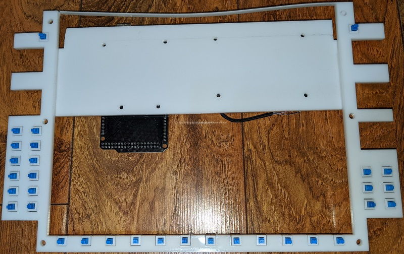

# Garmin G1000 suite for flight simulator

Back in my early days of seriously getting in flight simulator and starting to build panels around 2006, the idea of building a Garmin G1000 unit simply wasn't feasible. With the advent of consumer-grade 3D printers and laser cutters, that's now a reality.

This project draws heavy inspiration from [Allan Glen's C172 Garmin GNS430 and GNS530 units](https://cessna172sim.allanglen.com/). I started down that route for my own home cockpit (a 1975 Piper PA-28-151 fuselage).

Please read through all this before you get started. There's a lot of pieces to laser cut, 3D print, engrave, and assemble. I use Air Manager and X-Plane 11, but there's no reason this shouldn't work with other flight sims or controllers. I'm eagerly awaiting FS2020 to see!

* [Thingiverse project files](https://www.thingiverse.com/thing:4172029)
* [GitHub project files](https://github.com/fouldsy/piper-pa-28-flight-sim)

## Parts required

The following parts and components are required to build the G1000 units. The 10.4" LCD screens and then dual rotary enconders are the most expensive components. In total, this entire G100 was under $450 US, which is a whole lot less than commercial offerings, or even kit options. Even adding in the cost of a 3D printer and laser cutter, it's under $1,000 US.

### Panel components

The following items are needed to cut, attach, and finish the panels:

| Item | Dimensions | Quantity | Purchase |
|------|------------|----------|----------|
| 5mm cast white acrylic | 12" x 8" | 4 | |
| Pan head machine screws | #6-32 x 3/8" | 20 | [https://www.amazon.com/gp/product/B00F359CIS](https://www.amazon.com/gp/product/B00F359CIS) |
| Matt black spray paint | 12oz | 1 | |

### Screens, power, and HDMI

The following LCD screens and components are needed for the G1000 PFD / MFD units:

| Item | Quantity | Purchase |
|------|----------|----------|
| 10.4" LCD screen @ 1024x768 | 2 | [https://www.amazon.com/gp/product/B07R3RZC4F](https://www.amazon.com/gp/product/B07R3RZC4F) |
| 12V 2A power adapter | 2 | [https://www.amazon.com/gp/product/B00Q2E5IXW](https://www.amazon.com/gp/product/B00Q2E5IXW) |

### Hardware components

The following associated buttons, switches, and Arduinos are needed to actually run the suite of devices:

| Item | Quantity | Use  | Purchase |
|------|----------|------|----------|
| Arduino Mega 2560 | 2 | PFD / MFD wiring | [https://www.amazon.com/gp/product/B01H4ZDYCE](https://www.amazon.com/gp/product/B01H4ZDYCE) |
| Square 7mm x 7mm momentary mini push button | 85 | Panel buttons | [https://www.amazon.com/gp/product/B00OK476IG](https://www.amazon.com/gp/product/B00OK476IG) |
| 5mm dual rotary encoder with push button switch | 11 | NAV, COM, ALT, CRS/BARO, FMS, dummy audio | [https://www.propwashsim.com/store/dual-encoder-kit](https://www.propwashsim.com/store/dual-encoder-kit) |
| 6mm rotary encoder with push button switch | 2 | HDG control | [https://www.amazon.com/gp/product/B0177VGSQY](https://www.amazon.com/gp/product/B0177VGSQY) |
| 6mm rotary potentiometer | 4 | Dummy PFD / MFD volume control | [https://www.amazon.com/gp/product/B07DS5C7RF](https://www.amazon.com/gp/product/B07DS5C7RF) |
| 4-way directional switch with rotary encoder and push button | 2 | PFD / MFD range and pan control | [https://www.mouser.com/ProductDetail/ALPS/RKJXT1F42001?qs=6EGMNY9ZYDTsBzSTrhiL0w%3D%3D](https://www.mouser.com/ProductDetail/ALPS/RKJXT1F42001?qs=6EGMNY9ZYDTsBzSTrhiL0w%3D%3D) |
| Arduino Nano | 1 | Audio panel wiring | [https://www.amazon.com/gp/product/B07G99NNXL](https://www.amazon.com/gp/product/B07G99NNXL) |
| 15mm momentary red push button switch | 1 | Audio panel emergency flip | [https://www.amazon.com/gp/product/B019DSZQ9O](https://www.amazon.com/gp/product/B019DSZQ9O) |

## Make the G1000 faceplate

The PFD and MFD faceplates are each cut from 5mm cast white acrylic. A piece of acrylic cut to 12" x 8" works great. The cut-out section for the screen provides enough material to then cut out the required parts for the audio panel.

The `laser_cut/1000-faceplate.svg` file includes three layers - *vector*, *bevel*, and *engrave*. Use the *vector* layer to cut the outline for the faceplate. Without removing the piece of acrylic, then use the *bevel* layer to raster engrave the lines for the soft-key buttons.

Remove the faceplate from the laser cutter, pop-out the cut pieces for the buttons or screen holes, then remove any backing paper if needed. Use an alcohol cleaner to clean at least the front of the acrylic, as this is sprayed in the next step. You want to remove any residue left over from the laser cutting or protective film / paper.

Use a black spray paint (I used a matt finish) to spray the front of the faceplate. Use multiple light coats, and take care to minimize any dust in the spray area. Make sure the edges of the panel, button holes, and inside of the screen cut out are also sprayed black.

When the spray paint is dry, place a scrap piece of thin plywood in the laser cut, load the `laser_cut/g1000-faceplate.svg` file, and enable the *vector* layer. At a low power and high speed, vector cut this outline onto the plywood - it won't cut all the way through, but leaves a visible outline.

Carefully align the acrylic faceplate over the top of the etched outline on the plywood. If needed, use painters tape to hold in place. View the *engrave* layer, then raster engrave the faceplate to remove the layer of black spray paint and expose the white acrylic underneath for the lettering and graphics.

To protect the faceplate, lightly spray the faceplate with a clear matt protectant coat.

Repeat the process to create two such faceplates - one for the PFD, and one for the MFD.

## Make the G1000 hardware layer

The G1000 hardware layer is laser cut from the `laser_cut/g1000-hardware-mount.svg` file. As a suggestion, use the `laser_cut/kerf_test.svg` file to cut a single 7mm x 7 mm square in a piece of scrap acrylic. Test mount one of the momentary push button switches to see how snugly they fit. If they're too tight to push-fit into the acrylic, slightly increase the hole size and create another test cut. You want them just large enough to be able to gently push in place. If you need to update the size of the test hold, apply this updated measurement to the actual `laser_cut/g1000-hardware-mount.svg` file.

Once the hardware layer is cut from the acrylic, push fit the 7mm x 7mm momentary push button switches. A small spot of glue on each side of the switch holds them in place. This approach removes the need for PCB for the button mounts. Take care not to break the thin top strip like I did in this demo unit :)

The rotary encoder, dual rotary encoders, potentiometers, and 4-way switch are mounted to the rear of the faceplate (next section). They don't actually attach to the hardware layer due to the length of the shafts of those components and the thickness of the acrylic.

Repeat the process to create two such faceplates - one for the PFD, and one for the MFD.

## Attach the G1000 layers

The `laser_cut/g1000-electronics-mount.svg` file is used to attach the Arduino Mega 2560 and LCD driver board. Cut out this file on the laser cutter, then use #6-32 x 3/8" pan head machine screws or adhesive like Weld-On to attach the electronics mount to the back of the hardware mount.

Use #6-32 x 3/8" pan head machine screws to then attach the Arduino Mega 2560 and LCD driver board to the electronics mount.

Set the 10.4" LCD screen into place on the rear of the faceplate, then align the hardware mount and buttons with the faceplate. The buttons should be aligned in the center of the holes cut into the faceplate. The are two ways to attach hardware mount to the rear of the faceplate:

* Using #6-32 x 3/8" pan head machine screws
    * Carefully drill a shallow hole into the rear of the faceplate for the four hardware mount screws, then attach the two panels together.
* An arcylic-safe glue such as Weld-On
    * Follow the directions for your adhesive and attach the panels together.

I've tried both methods and prefer the accuracy of glueing the panels together. With needing to drill shallow holes in the rear of the faceplate to align with your buttons, it's easy to get that slightly offset and ruin the alignment.

3D print four copies of `3d_print/screen_clips.stl` and attach to the rear of the hardware mount to hold the LCD screen in place. The clips can be screwed or glued in place. Depending on where you mount the screen clips or actual screen you use, you may need a pair of the slightly shallower `3d_print/screen_clips_1mm.stl`.

Repeat the process to attach the layers - one for the PFD, and one for the MFD.

## Attach additional G1000 controls

With the hardware layer and faceplate joined using screws or adhesive, now attach the remaining controls to the faceplate. The following controls attach directly to the faceplate:

* Dual rotary encoders
* 6mm rotary encoder with push button (HDG control)
* 6mm rotary potentiometer (dummy VOL controls)
* 4-way directional switch with rotary encoder and push button (RANGE / PAN controls)

Depending on the controls you purchase, you may be able to use a nut and washer to attach to the shaft through the faceplate. If there's not enough length on the shaft to do this, you can use an adhesive to attach them.

Make sure you align the 4-way directional switch with rotary encoder up / down / left / right controls such that they correctly move horizontally and vertically.

Repeat the process to attach additional controls - one for the PFD, and one for the MFD.

## Wire up all the G1000 controls

Now the fun (?!) part. Wire up the all the controls to the Arduino Mega 2560. For ease of wiring, use a common ground around the outside of the hardware layer to the 7mm square push buttons. You can also then use this common groud for the all the rotary controls.

Color coding of wires may help to keep track of the wiring as you go. The Arduino Mega 2560 is almost completely full, so there's a lot of wires to solder and then connect. Keep track of what controls attach to which pin. I found it helped to configure Air Manager with the appropriate pins as I wired them up, even though the Arduino Mega 2560 wasn't connected.

When all the controls are wired up, connect the delicate video cable from the LED driver board. Take care when you attach the video cable so as not to damage it.

The 4-way directional switch with rotary encoder and push button is "fun" to wire. In the following image:

* The blue wire is common ground
* The two red wires are encoder up and down
* The four green wires are directional
* The yellow wire is center push button

Repeat the process to wire up the controls - one for the PFD, and one for the MFD.

## 3D print G1000 buttons and knobs

There are two different buttons for the G1000 unit. I suggest printing a few extra of each button to allow for spares when engraving:

* `3d_print/button_small.stl` buttons are for the 12 multi-purpose buttons across the bottom of the unit.
* `3d_print/button_medium.stl` buttons are for the 20 autopilot, FMS, and radio controls.

Print these buttons in white PLA. I enable ironing so the top of the buttons are smooth and minimize the need for sanding. Once printed, apply a few light coats of black spray, the same as when doing the faceplate.

Once the paint is dry, use the appropriate `engrave/g1000_button_small_engrave.svg` or `engrave/g1000_button_medium_engrave.svg` to laser engrave the button text. Use a scrap piece of wood to quick cut a low-power outline of the button, align the 3D printed button into the outline, then raster engrave each text layer. Hide and view the next layer in the SVG file each time to work your way through the text layers for the `_medium` buttons.

To protect the buttons, lightly spray them with a clear matt protectant coat.

Print the knobs in black PLA. There's no engraving of text to do on them:

* `3d_print/knob_heading.stl` - print 1 of these.
* `3d_print/knob_range_pan.stl` - print 1 one of these. Note that supports are needed for the buttom of the knob.
* `3d_print/knob_volume.stl` - print 2 of these for the dummy COM / NAV volume controls.

For a little extra detail, print in black PLA two of `3d_print/dummy_sd_card.stl`. These can then be glued into place in the SD card slots of the faceplate.

Repeat the process to 3D print and engrave the buttons and knobs - one for the PFD, and one for the MFD.

## Attach G1000 buttons and knobs

The 3D printed knobs should all push-fit onto their respective knobs. You don't need to glue these in place.

Use the knobs included with the dual rotary encoders as they're already made to fit each of the shafts.

Attach the 3D printed buttons by placing a small drop of glue on the shaft of the 7mm square buttons then placing the appropriate engrave button on top. I take care not to push down on the button to avoid potentially pushing any glue into the button mechanism. The buttons should just need a little alignment to make sure they glue and dry flat and square.

Repeat the process to attach the buttons and knobs - one for the PFD, and one for the MFD.

## G1000 connections and configuration

The LCD screen recommends a 12V 2A power supply and connects using a regular HDMI cable. No special drivers should be required as it should display as a regular additional monitor.

The Arduino Mega 2560 connects using a USB A-B cable. Depending on the software you use to connect to your flight sim of choice, you may need to load their software onto the Arduino board first. For example, in Air Manager (which is what I use), you run the **Air Manager Arduino installer** to prepare the board for use with the Air Manager software.

If you use Air Manager, the `instruments/` folder contains the following LUA files:

* `pfd/logic.lua` for the primary flight display (the pilot side).
* `mfd/logic.lua` for the multi-function display (the co-pilot side).
* `audio/logic.lua` for the audio panel, although only a subset of controls are actually configured based on availability within X-Plane (I assume P3D has similar limited functionality).

These LUA files can be loaded into Air Manager, and then simply select the channel you configured your Arduino Mega 2560 on and then the actual analog or digital pin for each control. The following table outlines how I configured my pins and controls, but yours may vary:

| Type | Name | Pin |
|------|------|-----|
| Button | NAV flip flop | D13 |
| Rotary encoder - pin A | NAV outer rotary control | D12 |
| Rotary encoder - pin B |  | D11 |
| Rotary encoder - pin A | NAV inner rotary control | D10 |
| Rotary encoder - pin B | | D9 |
| Button | NAV 1/2 (push) | D8 |
| Rotary encoder - pin A | HDG rotary control | D6
| Rotary encoder - pin B | | D7 |
| Button | HDG sync (push) | D5 |
| Button | Autopilot | D4 |
| Button | Flight director | D3 |
| Button | Autopilot HDG | D2 |
| Button | Autopilot ALT | D14 |
| Button | Autopilot NAV | D15 |
| Button | Autopilot VNAV | D16 |
| Button | Autopilot approach | D17 |
| Button | Autopilot backcourse | D18 |
| Button | Autpilot vertical speed | D19 |
| Button | Autopilot flight level change | D21
| Button | Autopilot nose up | D20 |
| Button | Autpilot nose down | D22 |
| Rotary encoder - pin A | Altitude outer rotary control | D23 |
| Rotary encoder - pin B | | D24 |
| Rotary encoder - pin A | Altitude inner rotary control | D25 |
| Rotary encoder - pin B | | D26 |
| Button | Softkey 1 | D27 |
| Button | Softkey 2 | D28 |
| Button | Softkey 3 | D29 |
| Button | Softkey 4 | D30 |
| Button | Softkey 5 | D31 |
| Button | Softkey 6 | D32 |
| Button | Softkey 7 | D33 |
| Button | Softkey 8 | D34 |
| Button | Softkey 9 | D35 |
| Button | Softkey 10 | D36 |
| Button | Softkey 11 | D37 |
| Button | Softkey 12 | D38 |
| Button | COM flip flip | A0 |
| Rotary encoder - pin A | COM outer rotary control | A7 |
| Rotary encoder - pin B | | A6 |
| Rotary encoder - pin A | COM inner rotary control | A5 |
| Rotary encoder - pin B | | A4 |
| Button | COM 1/2 (push) | A3 |
| Rotary encoder - pin A | CRS rotary control | A12 |
| Rotary encoder - pin B | | A11 | 
| Button | CRS sync (push) | A8 |
| Rotary encoder - pin A | Barometer rotary control | A10 |
| Rotary encoder - pin B | | A9 |
| Button | Pan up | D50 |
| Button | Pan right | D51 |
| Button | Pan down | D52 |
| Button | Pan left | D53 |
| Rotary encoder - pin A | Range rotary control | A15 |
| Rotary encoder - pin B | | A14 |
| Button | D-> | D49 |
| Button | Menu | D48 | 
| Button | Flight plan | D47 |
| Button | Procedures | D46 |
| Button | Clear | D45 |
| Button | Enter | D44 |
| Rotary encoder - pin A | FMS outer rotary control | D42 |
| Rotary encoder - pin B | | D43 |
| Rotary encoder - pin A | FMS inner rotary control | D40 |
| Rotary encoder - pin B | | D39 |
| Button | FMS cursor (push) | D41 |

Repeat the process to connect and configure the panel in software - one for the PFD, and one for the MFD.

## X-Plane 11 G1000 bezel-less display

For X-Plane 11, when you pop-out the G1000 PFD and MFD and drag the displays to the LCD screens, a bezel is displayed around the device. To only view the actual screen component, copy and paste the the following files:

* `cockpit/EFIS/G1000/G1000PFD_2d.png`
* `cockpit/EFIS/G1000/G1000PFD_2d.png`

into your `X-Plane 11/Aircraft/<name>` directory. These files create a 1×1 pixel blank PNG that remove the bezel.

The default Windows border is still displayed across the top, however the size of the faceplate is designed to hide this. Double-click the window to maximize and hide the bar behind the faceplate.

For more information, see [https://developer.x-plane.com/2017/09/three-lesser-known-aircraft-features-for-11-10/](https://developer.x-plane.com/2017/09/three-lesser-known-aircraft-features-for-11-10/).

## Make the G1000 audio panel

The G1000 audio panel is designed and built in the same way as the G1000 PFD and MFD panels. 

Laser cut the following from the same 5mm cast white acrylic material. You can use the pieces cut out for the PFD and MFD LCD panels:

* `laser_cut/audio-faceplate.svg`
* `laser_cut/audio-hardware-mount.svg`
* `laser_cut/audio-electronics-mount.svg`

Again, spray the audio faceplate with matt black paint, let it dry, then raster engrave the lettering and outlines from the *Engrave* layer in the `laser_cut/audio-faceplate.svg` file.

Push fit the 7mm x 7mm momentary push button switches into the audio hardware mount, and again, use a small spot of glue on each side of the switch holds them in place. This approach removes the need for PCB for the button mounts.

Attach the Arduino Nano to the electronics mount, then use Weld-On or similar adhesive to attach the electronics mount at 90 degrees to the hardware mount, between the two columns of buttons.

To wrap up the hardware components, attach the dual-rotary encoder and 15mm momentary red push button switch. The dual rotary encoder doesn't actually get wired up, it's just for show.

The 3mm green LEDs attach to the back of the audio panel faceplate. Apply a small spot of glue on either side of the LED to hold it in place. When dry, use Weld-On or similar adhesive to attach the faceplate to the hardware layer. Take care as you feed the LED legs through the cut-outs in the hardware layer.

For wiring, run a common ground to all the 7mm x 7mm square buttons and the cathode (short leg) of each 3mm LED.

Each anode (long leg) of the LED requires a resistor, around 200-400 ohm depending on your LEDs and how bright you want them. You can also control the brightness in the Air Manager `.lua` file.

## Completed G1000 suite

As I'm using a real Piper PA-28-151 cockpit, I removed the existing metal instrument panel traced the outline onto 3mm plywood. The outline was then cut, and then cut-outs made for where the G1000 units would go.

There's quite a bit of wiring behind the panel when all completed.

I used 90 degree adapters for the HDMI ports of the LCD driver boards to reduce cable clearance at the top when mounting into the cockpit also used left and right 90 degree USB cables for the PFD and MFD to again help with cable clearances. All three Arduinos connect to a powered USB hub.

## Limitations and considerations

As I went through the build process and have spent some time using the G1000 suite, there's a few things to point out that I may have done differently or may not quite line up with real-world use.

The following are things to bear in mind for your own builds if there's a concern:

* The top row of the LCD screen is a little hard to read depending on your eye level.
    * I typically use COM2 and NAV2 so I can clearly see the frequencies.
* The buttons aren't rubber, to the tactile response is a little different.
* There's no backlighting, but I don't think it's really worth it here.
    * I've done this for some F-18 panels, and it was a lot of effort. You could try to find 7mm x 7mm square buttons that include an LED to fairly easily backlight those, but I don't know how well the 3D printed buttons would respond.
    * I'll likely run an LED strip at the top of the glare shield in the cockpit anyway, and if you weren't in an enclosed cockpit, ambient room lighting would likely be sufficient.
* The LEDs in the audio panel are bright.
    * The photos actually make it appear worse than they are, but larger resistors may have been better (I used 330 ohm resistors).
    * I could also drop the brightness to `0.5` or `0.25` in Air Manager.

## Frequently asked questions

A few common questions that people have asked or may come up:

### How long did it take to build this?

In total, about 6-8 weeks including designing the panels themselves. The final G1000 panel for my PFD ended up taking about one week as I knew exactly how to make, assemble, and wire everything up.

### How many prototypes were there?

I think my MFD was the third build. First build was just the laser cut panels to see how they fit and the LCD screen would look. Second build refined the panels and got as far as 7mm x 7mm buttons and attaching the layers together. By the third build, everything came together correctly and was wired up. The PFD was a straight single build. The audio panel took two builds.

### Why a glass cockpit in a steam-driven cockpit?

It is and it isn't. The actual fuselage is from a 1975 Piper PA-28-151. I originally started down the path of steam-driven gauges, but the engineering to build these myself, or the cost to purchase commerical flight sim gauges was just too much.

I did build functional Garmin GNS-430, Garnmin GNS-530, and GMS-340 units, which were the inspiration for this G1000 suite. So, I ended up switching from the AeroSphere Piper PA28-161 Warrior II v2 flight sim model in X-Plane 11 to the AeroSphere Piper PA-28-181 Archer III model.

