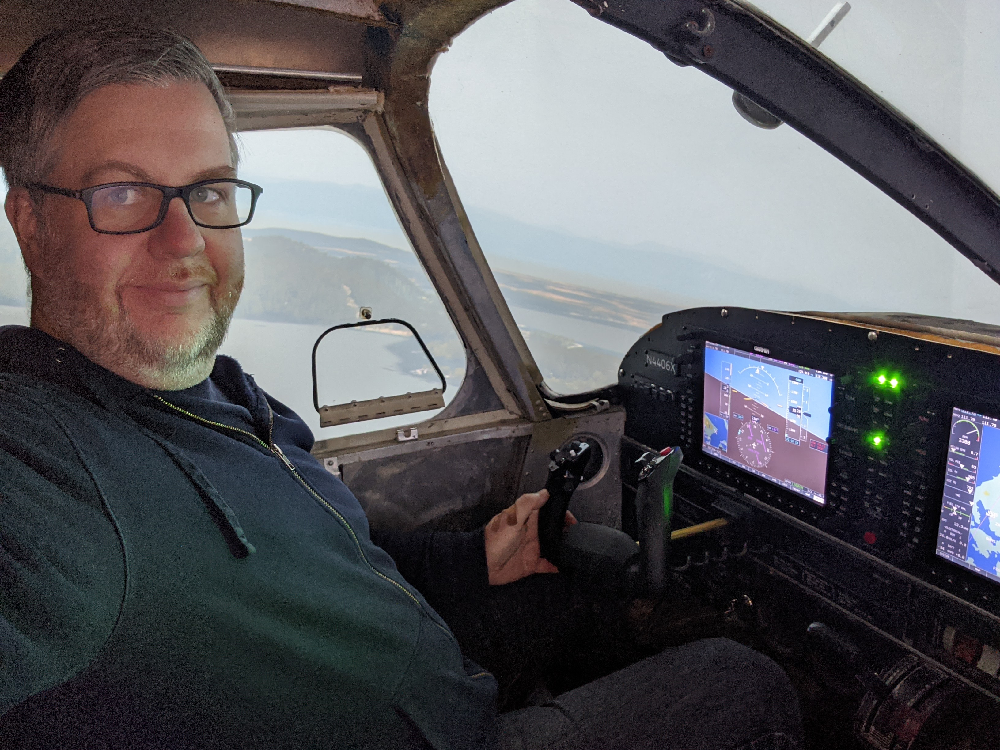

# Piper PA-28 project

After many years of flight simming, I'm currently building a flight simulator using the cockpit from a 1975 Piper PA-28-151 interfaced to X-Plane 11 using AirManager.

The cockpit is capable of running Microsoft Flight Simulator 2020, but the current development tools don't provide the full functionality required for what I consider to be try flight-worthiness. Visually, it's very impressive.

The following flight was taken over the San Juan Islands in X-Plane 11:

For more information, see [more about the cockpit](cockpit.md) or [building the Garmin G1000 suite](g1000.md).

Fully functional controls:

* Home made laser cut and 3D printed Garmin G1000 PFD, audio panel, and MFD
* Honeycomb Aeronautical Alpha yoke with shaft extension
* 3D printed fuel selector valve
* 5-position ignition switch

The following OEM hardware is also fully functional within the flight simulator:

* Switch panel
* Throttle and mixture controls
* Elevator trim wheel
* Flaps lever
* Parking brake
* Annunciator panel

See how I've [incorporated a lot OEM equipment for flight controls](flight-controls.html).

Current view of outside of the cockpit on runway 20 at Bremerton National (KPWT):

The 12ft diameter 180 degree curved screen uses two Optoma GT1080 short-throw projectors warped using [Immersive Display PRO from  Fly Elise-ng](https://fly.elise-ng.net/immersive-display-pro/). The screen surface is painted a light grey.
