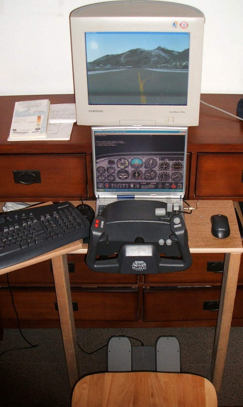
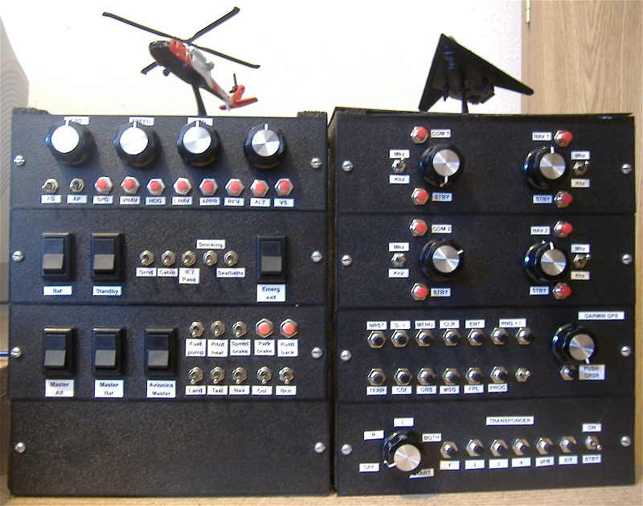
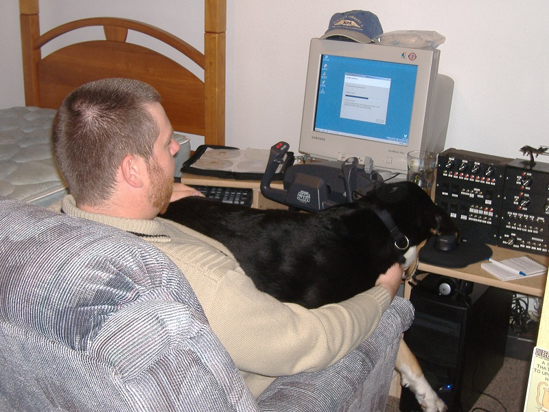
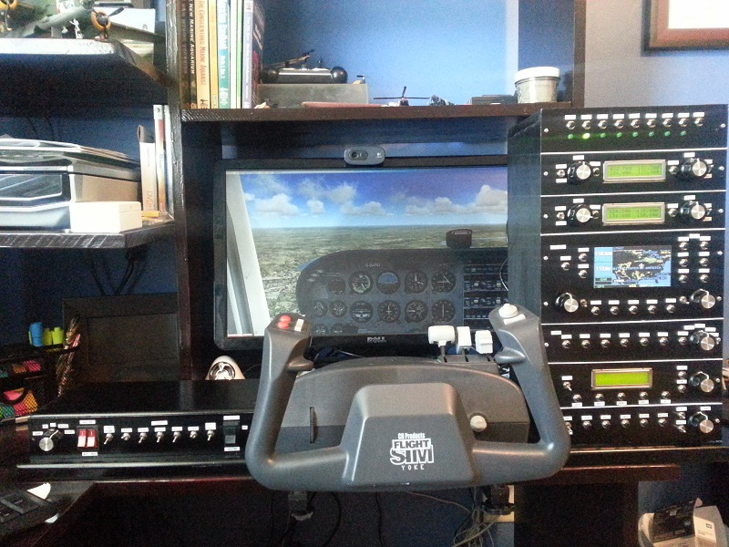
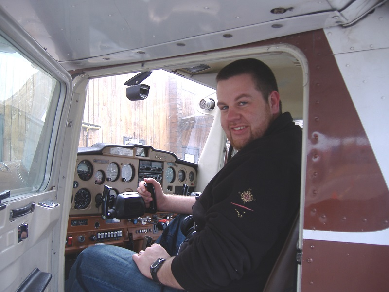

# Flight simulator cockpit history

The first flight sim experience I can recall was on my dad's Macintosh SE/30 in the early 1990s. I honestly don't know what version of Flight Sim this would have been, but from 1995, we had a Windows-based PC (Packard Bell), and I was using Microsoft Flight Simulator 5.1.

I moved through Flight Simulator for Windows 95, Flight Sim 98, Flight Sim 2000, and Flight Sim 2002. I miss the Microsoft Sidewinder Force Feedback joysticks! I also remember playing a multitude of the Janes flight sims, along with the Microsoft Combat Flight Simualtor series.

## First home cockpit build 
In 2005, I was getting ready to move to Alaska. I got heaily into Microsoft Flight Simulator 2004: A Century of Flight. After I moved in 2006, I got the CH Products yoke and rudder pedals, the first step beyond just a joystick. This was probably what I could call v1 of my home cockpits.

I often did 3-4hr flights in the PMDG 737-800 on routes like Anchorage -> Seattle on that wooden chair...

## Second home cockpit build - panels

By early 2008, I was looking at building panels. With only a single-speed power drill and almost nothing by way of real tools, I used some Desktop Aviator USB interface boards to build what would be v2 of my home cockpits.

These panels were a combination of wanting to do GA aircraft and passenger jets. Note the Garmin GPS unit - an LCD screen just wasn't really an option then. My co-pilot at the time also left a lot to be desired.

## Third home cockpit build - refined panels and radio LCDs

After moving to St. Louis, I re-thought my approach to panels. Still using Desktop Aviator USB interface cards, but now also using Arduinos and link2fs to drive LCD screens, along with profesionally cut metal panels.

This build worked well, and the LCDs for the radio panels definitely added a lot of immersion. I used this set up for a number of years, technically v3 of the home cockpits.

The GPS unit is using just a printed piece of card with a dummy Garmin 500 unit image, as still LCD screens were tough to find for that size and resolution to fit into the available space.

## VR and beyond

By 2017 and 2018 I was moving into VR with an Oculus Rift which added incredible immersion, but sacrificed resolution for reading instruments, along with lack of tactile feel for hardware control and panels.

I do still really enjoy VR for DCS: World, as for military jets, the immersion is incredible. For GA aircraft in flight simulator, my only real option was to finally step up to an actual cockpit, which is where I'm at now.

Yes, an actual cockpit as an extravagance. But, after briefly taking some flying lessons in a Cessna 152 out of Merrill Field, Anchorage, I've always felt lacking in immersion compared to the real thing. Basing a flight sim out of a real cockpit adds immediate immersion, especially with the 12ft diameter 180 degree curved screen. To me, it's worth it.

