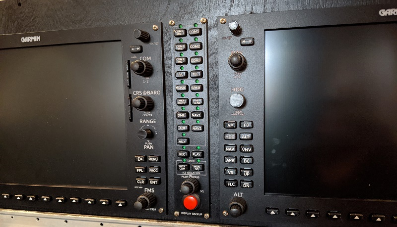
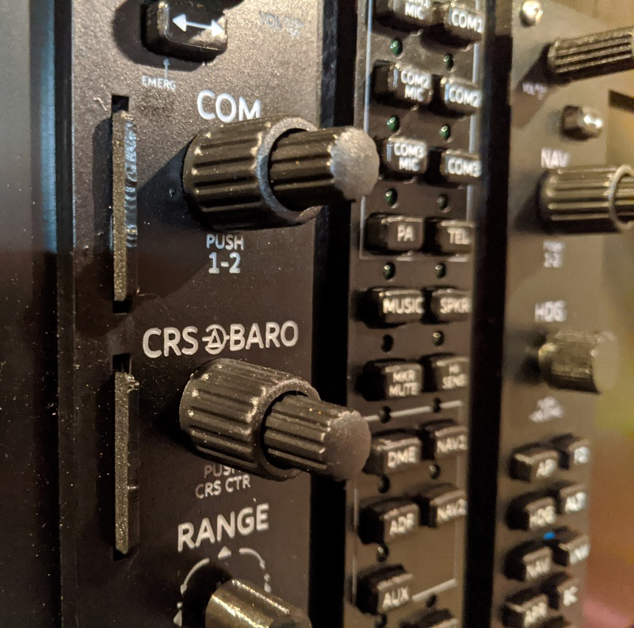

# Garmin G1000 suite for flight simulator

The supporting docs for building this Garmin G1000 suite is at [https://fouldsy.github.io/piper-pa-28-flight-sim/g1000.html](https://fouldsy.github.io/piper-pa-28-flight-sim/g1000.html)

